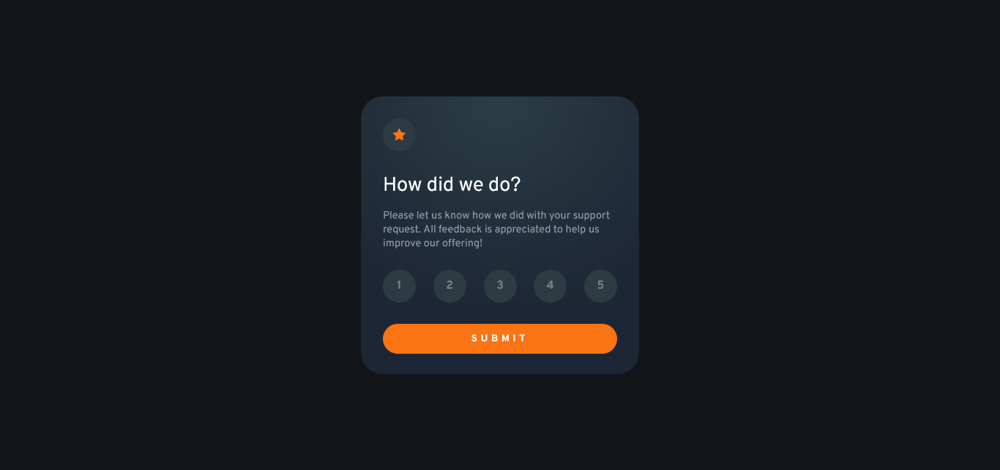

This is a solution to the [Interactive rating component challenge on Frontend Mentor](https://www.frontendmentor.io/challenges/interactive-rating-component-koxpeBUmI). Frontend Mentor challenges help you improve your coding skills by building realistic projects.

## Table of contents

- [Overview](#overview)
    - [The challenge](#the-challenge)
    - [Screenshot](#screenshot)
    - [Links](#links)
- [My process](#my-process)
    - [Built with](#built-with)
    - [What I learned](#what-i-learned)
    - [Useful resources](#useful-resources)
- [Author](#author)

## Overview

### The challenge

Users should be able to:

- View the optimal layout for the app depending on their device's screen size
- See hover states for all interactive elements on the page
- Select and submit a number rating
- See the "Thank you" card state after submitting a rating

### Screenshot




### Links

- Solution URL: [Interactive Rating Component using React and Styled-Components](https://www.frontendmentor.io/solutions/interactive-rating-component-using-react-and-styledcomponents-N8HgYGN8WO)
- Live Site URL: [Interactive Rating Component | Frontend Mentor](https://mamouty.github.io/interactive-rating-component-react/)
- Live Site URL: [Vanilla JavaScript version](https://endearing-pasca-b05534.netlify.app/)
  
## My process

### Built with

- Semantic HTML5 markup
- CSS custom properties
- Flexbox
- React - JS library 
- Styled Components - For styles
- Framer Motion - for animation

### What I learned

I had to go over the React documentation to learn how to set stat from parent components to control the behaviour of their children simultaneously and how to pass information form child component to parent.

In the component below for example, the onRender event is actually passed as an event handler with the information of the selected rating from one of its descendants to trigger an event handler:

```js
import {useState} from "react";
import styled from "styled-components";
import IRChoice from "./InteractiveRating-styled-components/IRChoice";
import IRThanks from "./InteractiveRating-styled-components/IRThanks";


function InteractiveRating() {
  const [isRated, setIsRated] = useState(0);

  const handleRender = (e, number) => {
    console.log(e);
    console.log(number);
    setIsRated(number);
  }

  return (
          <Main>
            {isRated === 0 ? <IRChoice onRender={handleRender}/> : <IRThanks rating={isRated}/>}
          </Main>
  );
}

export default InteractiveRating;

/* ------------------------------Styles------------------------------ */

const Main = styled.main`
    height: 100vh;
    background-color: hsl(216, 12%, 8%);
    display: flex;
    justify-content: center;
    align-items: center;
`;
```


### Useful resources

- [Sharing State Between Components](https://beta.reactjs.org/learn/sharing-state-between-components) - This section of the React documentation explains how to change state of components simultaneously by controlling them form their parent.


## Author
- Frontend Mentor - [@Mamouty](https://www.frontendmentor.io/profile/Mamouty)
- LinkedIn - [Mahmoud Guefri](https://www.linkedin.com/in/mahmoud-guefri-6b0269193/)